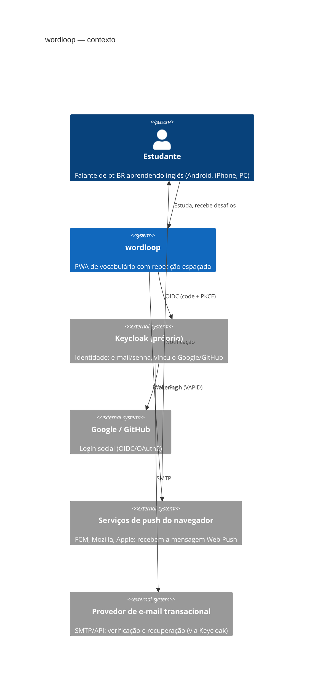
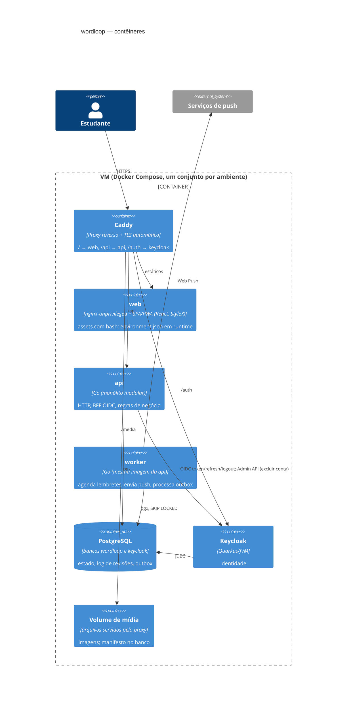
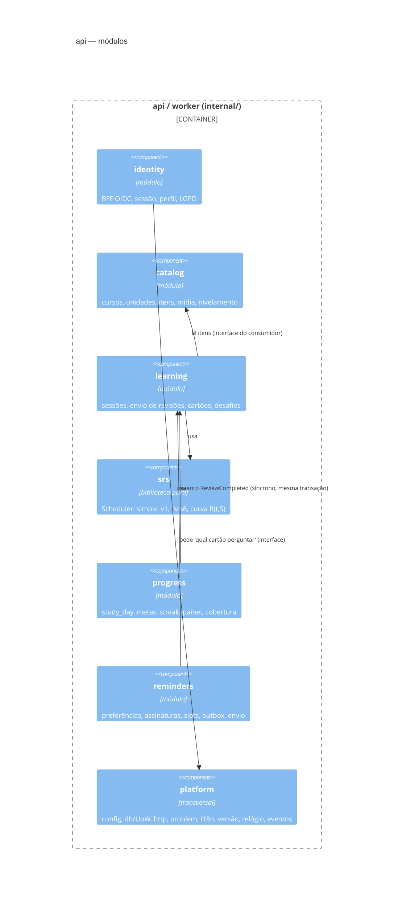

# Fase 3 — Diagramas (Mermaid)

## C4 nível 1 — Contexto



## C4 nível 2 — Contêineres (uma VM, ambientes tst e prd por Compose)



## C4 nível 3 — Componentes da API (módulos)



## Sequência 1 — Login social e vínculo de contas

```mermaid
sequenceDiagram
  autonumber
  actor U as Usuário
  participant W as SPA
  participant A as API (BFF)
  participant K as Keycloak
  participant G as Google
  participant M as E-mail
  U->>W: "Entrar com Google"
  W->>A: GET /api/v1/auth/login?provider=google
  A->>A: gera state, nonce, code_verifier (PKCE); guarda em cookie curto
  A-->>U: 302 para Keycloak (kc_idp_hint=google)
  U->>K: segue
  K->>G: autenticação
  G-->>K: identidade (e-mail, email_verified)
  alt já existe conta com o mesmo e-mail (criada por senha)
    K-->>U: "Já existe uma conta. Quer vincular?"
    alt prova por e-mail
      K->>M: link de confirmação
      U->>K: abre o link no e-mail
    else reautenticação
      U->>K: digita a senha da conta existente
    end
    K->>K: vincula a identidade Google à conta existente
  else e-mail novo
    K->>K: cria usuário (e-mail verificado pelo Google)
  end
  K-->>U: 302 /api/v1/auth/callback?code=...
  U->>A: callback
  A->>K: troca code + code_verifier por tokens (canal de trás)
  A->>A: valida ID token; upsert app_user (sub); cria auth_session (refresh cifrado)
  A-->>U: Set-Cookie wl_session (httpOnly, Secure, SameSite=Lax) + 302 para a SPA
  Note over K,G: Depois de vinculadas, qualquer forma de entrar chega ao mesmo sub.
```

## Sequência 2 — Notificação-desafio (Web Push)

```mermaid
sequenceDiagram
  autonumber
  participant S as worker (agendador)
  participant DB as PostgreSQL
  participant L as learning (interface)
  participant P as webpush-go
  participant PS as Serviço de push
  participant SW as Service Worker
  actor U as Usuário
  participant W as SPA
  S->>DB: 1x/dia por usuário: sorteia reminder_slot (janela, fuso, máx/dia)
  loop a cada minuto
    S->>DB: slots vencidos (status=planned, fire_at <= agora)
    S->>L: "qual cartão perguntar?" (vencido/aprendendo, menor R)
    L-->>S: card_id + pergunta curta (sem a resposta)
    S->>DB: INSERT notification + outbox(push.send) na mesma transação
  end
  S->>DB: outbox: SELECT ... FOR UPDATE SKIP LOCKED
  S->>P: envia payload cifrado (RFC 8291) com VAPID (RFC 8292)
  P->>PS: POST no endpoint da assinatura
  alt 404/410
    S->>DB: assinatura = expired; notification_delivery = gone
  else erro temporário
    S->>DB: attempts+1, available_at = backoff
  else ok
    PS-->>SW: evento push
    SW-->>U: showNotification(pergunta; tag = notification.id)
  end
  U->>SW: toca na notificação
  SW->>W: clients.openWindow(/study/challenge/{id})
  W->>L: GET /study/challenges/{id}
  U->>W: responde; escolhe dificuldade
  W->>L: POST /study/reviews (source=notification, UUID do cliente)
  L-->>W: novo estado; explicação e imagem de contexto
```

## Sequência 3 — Sessão de estudo (online e offline)

```mermaid
sequenceDiagram
  autonumber
  actor U as Usuário
  participant W as SPA
  participant IDB as IndexedDB
  participant A as API (learning)
  participant DB as PostgreSQL
  U->>W: "Quanto tempo hoje?" (5/15/30/60)
  W->>A: POST /study/plan
  A->>DB: cartões vencidos (menor R) + novos (limite pelos minutos)
  A-->>W: pacote (cartões + conteúdo + mídia) + session_id
  W->>IDB: guarda pacote
  loop cada exercício
    U->>W: responde
    W->>W: corrige no cliente (gabarito veio no pacote); sugere dificuldade (tempo)
    U->>W: escolhe Fácil / Médio / Difícil
    W->>IDB: fila de revisões (UUID, client_seq)
    W->>A: POST /study/reviews (lote) quando online
    A->>DB: UoW: INSERT review_log (ON CONFLICT DO NOTHING) + UPDATE card (Scheduler.Next) + study_day
    A-->>W: resultados por revisão (applied/duplicate/rejected)
    W->>IDB: remove enviadas
  end
  Note over W,A: Sem rede: a fila cresce e é enviada ao reabrir ou ao evento "online". Reenvio é seguro por causa do UUID.
  Note over A: O servidor recorrige a resposta e recalcula a nota: o cliente nunca decide o estado do cartão.
```
