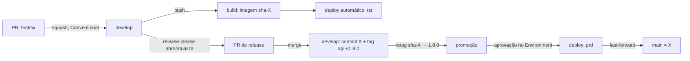

# Fase 4 — Engenharia: repositório, pipelines, versão, ambientes, deploy, qualidade e kit para IA

> **Decisões do usuário após a Fase 4 (prevalecem sobre o texto abaixo):** (1) licenças: seguir como planejado (MIT no código, CC BY-SA 4.0 em `content/`); o documento sobre MIT não foi enviado e, por ora, **não bloqueia**; (2) squash com título da PR em Conventional Commits: ok; (3) **`main` avançada manualmente** pelo dono após cada release em prd (sem GitHub App); (4) backup fora da VM: **Cloudflare R2** (10 GB gratuitos, sem custo de saída; Backblaze B2 também tem 10 GB e é a alternativa) `[VERIFICAR]` se a conta exige cartão; (5) `lefthook` com `check` no pré-push: ok.
> **Consequência do item 3:** some o spike do GitHub App; o passo vira item do checklist de release: `git push origin <sha-da-tag>:main` (fast-forward). A ruleset de `main` libera só o administrador.

> Data: 2026-10-06. Produto: **wordloop**. Rótulos: `[PREMISSA]` assumi; `[VERIFICAR]` não confirmei em fonte primária; `[DECISÃO SUA]` só você decide.
> **Arquivos:** [esqueletos de workflows](workflows/) (YAML validado por parser; **não executados**) · [esqueleto de deploy](deploy/deploy-skeleton.md) (Compose, Caddy, nginx, Dockerfiles, `deploy.sh`; **não executados**) · [kit de convenções para IA](kit-ia/) (`guard.mjs` **testado**: 13/13 casos; sintaxe dos scripts e do `settings.json` verificada).
> **Decisões já fechadas:** monorepo público `keven-rdr/wordloop`; `develop` + `main`; Sonar Cloud com `develop` como branch principal; GitHub Actions; ambientes dev/tst/prd; **um Keycloak com dois realms**; VM Contabo 12 GB; Compose.

## 1. Tabela de decisões

| Decisão | Recomendação | Alternativas descartadas | Por quê |
|---|---|---|---|
| Merge em `develop` | **Squash**, com **título da PR em Conventional Commits** (validado no CI) | merge commit; rebase | 1 commit por PR = o que o release-please lê; histórico limpo |
| Versão | **release-please** em modo monorepo; tags `api-vX.Y.Z` e `web-vX.Y.Z` | semantic-release; `svu`; *bump* por bot em `package.json` como no Contratos | PR de release revisável; sem commit de bot em loop; uma versão por componente |
| Versão em tst | derivada do Git: `git describe` → `1.7.2-5-gabc123` | pré-releases com contador (`-tst.12`) | Sem arquivo para editar nem commit de bot |
| Artefato | **Build uma vez** na `develop` (`sha-<commit>`); a **mesma imagem** é só **re-etiquetada** (`1.8.0`) e promovida | rebuild por ambiente/tag | O que foi testado em tst é o que roda em prd |
| Promoção | `deploy.yml` + **GitHub Environments**; tag da imagem passada ao `deploy.sh` por **SSH com comando forçado** | commit de bot com a tag num overlay; k3s + Argo CD; *runner* self-hosted | Commit de bot em branch protegida gera laço, ruído e desvio entre `develop` e `main`; *runner* self-hosted em repo **público** é risco (PRs de fork) |
| `main` | aponta para **o código que está em prd** (avança por *fast-forward* após deploy em prd) | merge de PR `develop → main` | Merge de tudo da `develop` colocaria código não lançado em `main` |
| Sonar | SonarQube Cloud Free, **dois projetos** (`api`, `web`) | self-hosted; um projeto único | Free analisa PR/branch **só da branch principal** do projeto: com `develop` como principal, as PRs para `develop` são analisadas |
| Check obrigatório | um job **`gate`** por workflow (passa se tudo foi OK **ou pulado**) | filtro de caminho no gatilho | Filtro no gatilho deixa o check "pendente" e trava o merge |
| Dependências | **Renovate** (app grátis) | Dependabot | Fixar versão exata e agrupar `@stylexjs/*` e `hey-api` |
| Backup | `pg_dump` criptografado (`age`) → bucket fora da VM; restauração testada | snapshot da Contabo | Cópia fora do provedor; restauração é o que importa |

## 2. Repositório, branches e regras

**Estrutura:** `api/`, `web/`, `deploy/`, `docs/`, `content/` (conteúdo CC BY-SA), `scripts/`, `.github/`, `.claude/`, `AGENTS.md`, `CLAUDE.md`, `LICENSE` (MIT), `NOTICE.md`. **Monorepo** vence dois repositórios porque contrato OpenAPI, cliente gerado e deploy mudam juntos; um 3º repositório de infra (Contratos) só se justifica com equipes separadas.
**Branches:** `develop` (integração → tst), `main` (= prd), `feat/*`, `fix/*`. **Renomear `main` → `develop`** é o primeiro passo do Sprint 1 (local e remoto; ação visível, só com sua confirmação); `main` nasce de novo no primeiro release. `develop` vira a branch padrão no GitHub e a branch principal no Sonar.
**Rulesets (GitHub):**

| Branch | Regras |
|---|---|
| `develop` | exigir PR; checks `api-ci / gate`, `web-ci / gate`, Sonar; squash; sem *force push*; sem exclusão. Aprovações: 0 (você é o único autor; o GitHub não deixa auto-aprovar) |
| `main` | **só atualização por *bypass*** (quem avança é o fluxo de release); sem *force push* nem exclusão |
| tags `api-v*`, `web-v*` | criação só pelo release-please |

**Avanço de `main`:** o `github-actions[bot]` **não aparece como ator de bypass** nas rulesets; a saída é um **GitHub App** próprio com bypass (ou o seu usuário/admin). `[VERIFICAR]` no spike. Plano B: você roda um comando manual após cada release.

## 3. Versionamento e fluxo de release

- **Pré-1.0** até o MVP chegar em prd (`bump-minor-pre-major`).
- **Config:** `release-please-config.json` com `"separate-pull-requests": true`, `"include-component-in-tag": true`; pacotes `api` (`release-type: simple`) e `web` (`node`, atualiza `package.json`); `.release-please-manifest.json` com `{ "api": "0.0.0", "web": "0.0.0" }`.
- **Atribuição por caminho:** o release-please usa os arquivos alterados para dizer qual componente mudou `[VERIFICAR]`; escopo no commit (`feat(api):`) ajuda, não substitui.
- **Armadilha:** tag criada com o `GITHUB_TOKEN` **não dispara outros workflows**; por isso a promoção está **no mesmo arquivo** (`release-please.yml`).
- **Versão visível:** `-ldflags -X` (Go) e `define` do Vite; `GET /api/v1/version` e rodapé do app: "v0.4.0 · API v0.6.1 · tst · a1b2c3d". Em prd (build exatamente na tag) mostra só `0.6.1`.

## 4. Pipelines (mapa do Contratos → GitHub Actions)

| Contratos (Azure) | Aqui | Notas |
|---|---|---|
| `build` | job `image` (`api-ci`, `web-ci`) | só em push na `develop`; cache `type=gha`; *provenance*; Trivy na imagem |
| `increment-version` | `release-please.yml` | sem commit de bot em laço |
| `sonar` / `sonar-pullrequest` | job `sonar` (mesmo job: a action distingue PR de branch) | token **só** por secret; `fetch-depth: 0`; **nunca** `--build-arg` |
| `unit-tests` | `test-unit` | Go: `-race -short`; web: Vitest com cobertura |
| `integration-tests` | `test-integration` | Go: Testcontainers (Postgres; Keycloak no teste do BFF) |
| — | `lint`, `e2e`, `lighthouse`, `vuln`, `deploy`, `release` | novos |

Detalhes que importam:
- **web-ci:** Biome (`biome ci`) + **ESLint só** para StyleX, tamanho/complexidade e imports entre features; `tsc -b` (TypeScript 7 nativo; `typescript-eslint` com o alias TS 6, validado no Sprint 0a); `check:i18n`; cliente gerado em dia (`git diff --exit-code`); Vitest; **Playwright** (Chromium, pt-BR, fuso fixo, specs por feature com mocks); **Lighthouse CI** só para desempenho, acessibilidade e boas práticas: **a categoria PWA foi descontinuada** ([resultado de busca](https://tessl.io/registry/testland/lighthouse-pwa-audit)), então manifesto, *service worker* e recarga offline viram testes do Playwright.
- **api-ci:** `go vet`, `golangci-lint` v2 (`depguard`, `funlen`, `cyclop`, `gosec`), `go-arch-lint`, `scripts/check-structure`, código gerado em dia (OpenAPI + sqlc), testes de **todos** os casos de uso, handlers e repositórios, `govulncheck`, validação do OpenAPI.
- **Minutos:** repositório **público** usa *runners* padrão sem custo (a limitação de 2.000 min/mês vale para privado); mesmo assim: cache de Go/Node/Docker/Playwright, `concurrency` cancelando execuções antigas e filtros por caminho.
- **Quality gate:** no plano Free **não se personaliza**; vale o padrão "Sonar way" (código novo: cobertura, duplicação, notas A, *hotspots* revisados) `[VERIFICAR] limiares`. O que o Sonar não cobre (tamanho de arquivo, camadas, i18n) é imposto por `check-structure`, `depguard`/`go-arch-lint` e ESLint.
- **Segurança no CI:** `security.yml` semanal e em PR: CodeQL (Go e TypeScript), `gitleaks`, Trivy (sistema de arquivos e imagem). **Ações de terceiros fixadas por SHA** (preset do Renovate); o `trivy-action` e as demais entram só depois de fixadas.

## 5. Ambientes, deploy e operação

| | dev | tst | prd |
|---|---|---|---|
| Onde | seu PC (Compose; API/web fora do Compose) | VM | VM |
| Domínio | `localhost` | `tst.wordloop.com.br` | `wordloop.com.br` |
| IdP | Keycloak do Compose (`wordloop-dev`) | realm `wordloop-tst` | realm `wordloop-prd` |
| Dados | sintéticos | sintéticos + seed | reais |
| Deploy | — | **automático** a cada push na `develop` | **manual**, aprovado no Environment, só de tag |

**Segredos:** por Environment (`tst`, `prd`): `DEPLOY_SSH_KEY`, `DEPLOY_HOST`, `DEPLOY_USER`, `DEPLOY_KNOWN_HOSTS`; `PUBLIC_HOST` como variável. Segredos de runtime (banco, OIDC, VAPID, chave de sessão) **só na VM** (`.env.secrets`, modo 600). Environment `prd` com **revisor obrigatório** e restrição a tags/`main`: **disponível em repositório público no plano Free** ([documentação](https://docs.github.com/en/actions/reference/workflows-and-actions/deployments-and-environments)).
**SSH de deploy:** usuário `deploy` sem shell livre; chave com `command="/srv/wordloop/deploy.sh"`; o script valida `ENV` e tags por expressão regular. **Sem *runner* self-hosted.**
**Ordem do deploy:** `pull` → **migração** (`api migrate up`) → `up -d` → *smoke test* (`/health/ready`, `/version`, `environment.json`, `/`). **Migração compatível com rollback** (*expand/contract*): rollback = rodar o deploy com a tag anterior (`workflow_dispatch`). Migração destrutiva só numa versão posterior.
**Cache do front:** `/assets/*` imutáveis; `index.html`, `sw.js`, manifesto: `no-cache`; `environment.json`: `no-store` (nginx no esqueleto).
**VM:** Ubuntu LTS, `ufw` (22 só por chave, 80, 443), `unattended-upgrades`, SSH sem senha. Só o Caddy publica portas (porta publicada pelo Docker **contorna** o `ufw`).
**Operação:** backup noturno com teste de restauração mensal; `healthchecks.io` avisa se o backup falhar `[VERIFICAR]` plano gratuito; monitoramento HTTP com Uptime Kuma (auto-hospedado) `[PREMISSA]`; limites de memória por contêiner; rotação de logs do Docker. **Keycloak compartilhado:** versão fixa por digest, exportar os dois realms antes de atualizar, ensaiar a atualização no Compose de dev e anunciar janela de manutenção.

## 6. Qualidade local = qualidade no CI (shift-left)

- **Um comando:** `npm run check` na raiz (Definition of Done): descobre quais componentes mudaram (`git diff` contra a base) e roda: Go: `gofmt`, `go vet`, `golangci-lint run --new-from-rev=<merge-base>` (só problemas **novos**), testes curtos; web: Biome, ESLint, `tsc`, `vitest related`, **[check-changed-lines.mjs](kit-ia/scripts/check-changed-lines.mjs)** (regras do Sonar nas **linhas alteradas** pelo `merge-base`, a mesma ideia do `check-sonar-rules.mjs`, reescrita do zero; hoje com 3 regras de exemplo). `check:all` roda tudo.
- **Git:** `lefthook` (pré-commit: formatar arquivos *staged*; `commit-msg`: `commitlint`; pré-push: `check`) `[VERIFICAR]` pacote npm. `.gitattributes` com `* text=auto eol=lf` (Windows).
- **Claude Code** (sintaxe **conferida** na documentação de hoje): `CLAUDE.md` com `@AGENTS.md`; `AGENTS.md` de subpasta é carregado quando se abre arquivo ali; hook `PreToolUse` com `matcher` e saída **exit 2** para bloquear; skill em `.claude/skills/<nome>/SKILL.md` com `name`, `description`, `allowed-tools`, `disable-model-invocation`. A documentação recomenda **< 200 linhas** por `CLAUDE.md` e lembra que instrução é contexto, não garantia: **o que não pode acontecer vai para hook**.

| Camada | Arquivo | Para quê |
|---|---|---|
| Regra escrita, com precedência | `AGENTS.md` (raiz, `api/`, `web/`) | 11 regras obrigatórias; comandos; arquitetura em 8 linhas |
| Import | `CLAUDE.md` | só `@AGENTS.md` + notas do Claude Code |
| Bloqueio | `.claude/hooks/guard.mjs` | nega `.env*`, código gerado, arquivo > 300 linhas, texto de UI literal, cor crua, erro de API com string |
| Fluxo | `.claude/skills/wl-flow/SKILL.md` | máquina de estados única, gates, verificação antes de "concluído" |
| Processo | `.github/pull_request_template.md`, `docs/features/_TEMPLATE.md`, `docs/guides/new-feature.md` | PR sem lista de arquivos; documento vivo; feature de referência (**Configurações**) |

## 7. Licenças (o seu documento sobre MIT ainda não chegou)

Plano até lá `[PREMISSA]`: `LICENSE` MIT na raiz (código); `content/LICENSE` CC BY-SA 4.0 (conteúdo) e `NOTICE.md` gerado de `source`/`attribution`; verificação de licenças de dependências no CI (ex.: `go-licenses`, `license-checker`) `[VERIFICAR]`. **Envie o documento** e eu confronto com isto antes de fechar a Fase 4.

## 8. Riscos e spikes do Sprint 0 (acrescentam-se aos da Fase 3)

| Risco | Mitigação |
|---|---|
| Avanço de `main` por bot (ruleset sem ator `github-actions[bot]`) | GitHub App com bypass; plano B manual |
| release-please não atribui commit ao componente certo | testar com PRs de exemplo em `api/` e `web/` |
| Keycloak único = ponto único de falha para tst e prd | digest fixo, export de realms, ensaio em dev, janela de manutenção |
| SSH exposto | só chave, `fail2ban`, usuário restrito por comando forçado; Tailscale opcional |
| Ações de terceiros comprometidas | fixar por SHA; permissões mínimas por job |
| Disco/CPU variável em VPS barato | monitorar; backup fora da VM |
| CSP vs. StyleX dinâmico (`style` inline) | `style-src-attr` no Caddy; testar no spike |

**Spikes adicionais:** (6) release-please em monorepo com PRs de exemplo; (7) GitHub App + ruleset para avançar `main`; (8) deploy ponta a ponta tst numa VM de teste (ou na própria VM antes do prd); (9) restauração de backup; (10) Sonar Cloud: criar os dois projetos e `develop` como branch principal.
**`[DECISÃO SUA]`:** (1) squash + título da PR em Conventional Commits? (2) `main` avançado por GitHub App (recomendado) ou manualmente por você? (3) Backup fora da VM: Backblaze B2 ou Cloudflare R2? (4) Aceita o `lefthook` com `check` no pré-push?

## 9. Resumo de continuidade (≤ 300 palavras)

Fase 4 concluída (falta "ok", 4 decisões da seção 8 e o documento sobre MIT). Monorepo `keven-rdr/wordloop` (`api/`, `web/`, `deploy/`, `docs/`, `content/`, `scripts/`). Branches: `develop` (integração → tst; branch principal no Sonar) e `main` (= prd, avança por fast-forward após deploy). Merge **squash** com título Conventional. Build **uma vez** na `develop` (`sha-X`); release-please (monorepo, tags `api-vX`/`web-vX`) → mesma imagem **re-etiquetada** e promovida a prd com aprovação no Environment; tst usa `git describe`. Deploy por SSH com **comando forçado** (`deploy.sh`: pull → migração expand/contract → up → smoke); rollback = redeploy da tag anterior; sem *runner* self-hosted. VM Contabo (12 GB): três projetos Compose (`shared`: Caddy, Postgres com 3 bancos, **um Keycloak com 2 realms**; `tst`; `prd`), só o Caddy publica portas, nginx com cache correto, imagens por tag+digest, configuração em runtime (`environment.json`). Workflows: `api-ci`, `web-ci` (Biome + ESLint só StyleX, Vitest, Playwright, Lighthouse sem PWA), `security`, `release`, `deploy`; check obrigatório = `gate` por workflow. Sonar Cloud Free: 2 projetos, quality gate fixo ("Sonar way"). Renovate, CodeQL, gitleaks, Trivy, ações fixadas por SHA. Backup `pg_dump` + `age` fora da VM. Qualidade local: `npm run check` (+ `--new-from-rev`, linhas alteradas), `lefthook`. Kit de IA: `AGENTS.md` canônico (raiz/`api`/`web`), `CLAUDE.md` com `@AGENTS.md`, hook `guard.mjs` testado, skill `wl-flow`, template de PR, documento vivo, guia com feature de referência (Configurações). Pendências: spikes 6–10; licenças (aguardando documento). Próxima: Fase 5 (UX/UI e fluxos).
