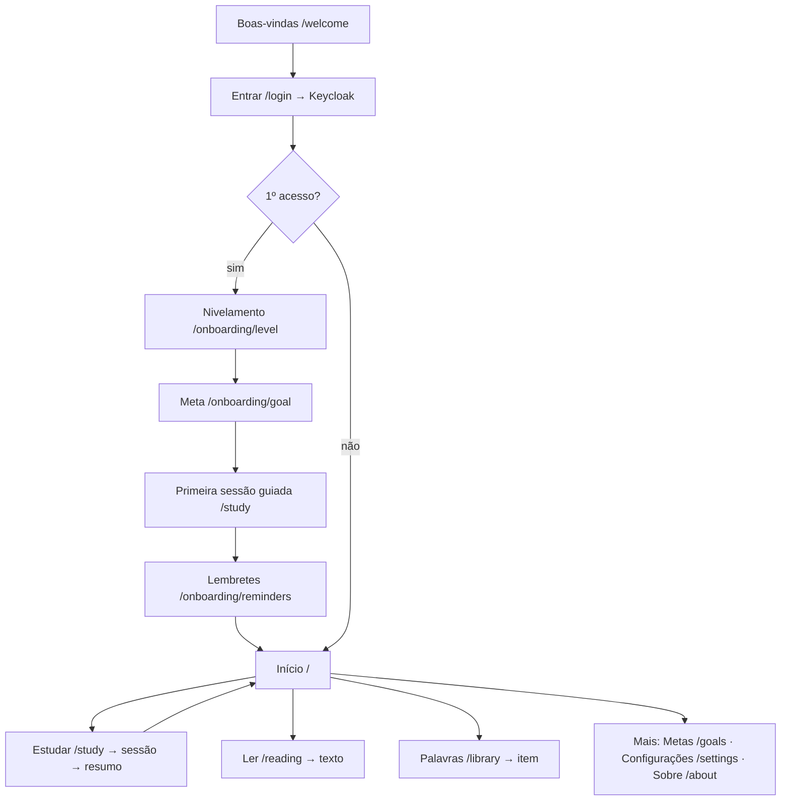

# Fase 5 — UX/UI e fluxos

> Data: 2026-10-06. Produto: **wordloop**. Rótulos: `[PREMISSA]` assumi; `[VERIFICAR]` não confirmei; `[DECISÃO SUA]` só você decide.
> **Arquivos:** [wireframes em texto](05b-wireframes.md) (13 telas e estados) · tokens, temas e primitivas já definidos em [03d](../fase-3/03d-design-system-stylex.md) · regras de exercício em [Fase 1](../fase-1/01-srs.md#9-política-de-exercícios).
> Diagramas Mermaid **não foram renderizados**. Nada aqui foi testado com usuários.
> **Decisões após a Fase 4:** `main` avançada à mão; backup em Cloudflare R2; `lefthook` ok; licenças como planejado (o documento sobre MIT não chegou e não bloqueia).
> **Decisões do usuário após a Fase 5 (prevalecem sobre o texto abaixo):** (1) **"não"** à barra de 5 itens com "Ler" visível mesmo bloqueado. Interpretação adotada `[PREMISSA]`: **barra inferior com 4 itens (Início · Estudar · Palavras · Mais)**; **"Ler" só aparece quando há texto liberado** (≥ 95% de cobertura), e antes disso o Início mostra um cartão "Próximo texto: você conhece 91%". Corrija se a sua intenção era outra. (2) Sequência por "≥ 1 revisão" e dias fora da meta sem quebrar: **sim**. (3) Sons desligados por padrão: **sim**. (4) Tema padrão = sistema: **sim**. (5) Sem mascote no MVP: **sim**. (6) Ícones Lucide: **sim** (`[VERIFICAR]` licença no Sprint 0).

## 1. Tabela de decisões

| Decisão | Recomendação | Alternativas descartadas | Por quê |
|---|---|---|---|
| Navegação | **Barra inferior com 5 itens** no celular (Início · Estudar · Ler · Palavras · Mais); menu lateral no desktop | menu hambúrguer; 4 itens | "Ler" é o seu objetivo final e deve estar à vista, mesmo bloqueado, mostrando quanto falta |
| Medalha de progresso | **Palavras conhecidas + cobertura do texto**; sem XP, sem ranking | pontos (XP), ligas | Seu pedido: o que importa é melhorar, não cumprir minutos; ranking não existe em app pessoal |
| Sequência | **Dia estudado = ≥ 1 revisão**; dias fora da meta **não quebram** | meia-noite estrita; "congelar sequência" pago/limitado | Casa com a meta dinâmica por dias da semana; sem culpa |
| Dificuldade | 1 toque **escolhe e avança**; Enter aceita a sugestão | botão "Continuar" separado | Menos atrito, o controle continua seu (Fase 1) |
| Avisos | Pedido **depois da 1ª sessão**, por toque; no iPhone, só **depois de instalado** | pedir na abertura | Taxa de aceite maior e exigência do iOS (Fase 3) |
| Áudio | **TTS do navegador** (`speechSynthesis`), com detecção de voz em inglês | arquivos de áudio | Sem custo e sem licença; exercício some se não houver voz |
| Ícones | **Lucide** (SVG individuais; ISC `[VERIFICAR]` licença) + OpenMoji nos itens | emoji do sistema; biblioteca gigante | Estilo único, sem peso |
| Mascote | **Nenhum** no MVP | personagem | Evita parecer cópia e custo de arte |
| Analytics | **Sem terceiros**; só `study_day` e logs do servidor | Google Analytics etc. | LGPD e simplicidade |

## 2. Princípios (inspirados em ideias gerais do Duolingo, sem copiar marca, mascote, fontes ou assets)

1. **Uma ação principal por tela.** Um botão primário "3D"; o resto é secundário.
2. **Feedback imediato e honesto:** ícone + texto + cor (nunca só cor); a resposta correta sempre aparece.
3. **Recuperar antes de ver:** a imagem e a explicação vêm **depois** da tentativa (Fase 1).
4. **Progresso visível e positivo:** mostrar o **ganho** ("+8 palavras conhecidas"), nunca culpa ("você perdeu a sequência").
5. **Sessões curtas e retomáveis:** sair no meio guarda tudo; "Mais 5 minutos" no fim.
6. **Você no controle:** metas, lembretes, dificuldade e idioma são seus; nada de padrões manipuladores.
7. **Funciona sem rede:** o pacote de estudo vai para o aparelho; o que acontece offline aparece com clareza.

## 3. Mapa de telas



| Rota | Tela | Feature | MVP |
|---|---|---|---|
| `/welcome`, `/login` | Boas-vindas, entrar | `auth` | sim |
| `/onboarding/{level,goal,reminders,install}` | Nivelamento, meta, lembretes, instalar | `onboarding` | sim |
| `/` | Início (painel) | `dashboard` | sim |
| `/study`, `/study/session/:id`, `/study/summary/:id` | Plano ("quanto tempo hoje?"), sessão, resumo | `study` | sim |
| `/study/challenge/:notificationId` | Desafio vindo da notificação | `study` | sim |
| `/goals`, `/goals/review` | Meta do ciclo, retrospectiva e nova meta | `goals` | sim |
| `/library`, `/library/items/:id` | Palavras e detalhe (com "Reportar problema") | `library` | sim |
| `/reading`, `/reading/:textId` | Lista de textos (bloqueados/liberados), leitura | `reading` | **depois do núcleo** `[PREMISSA]` |
| `/settings/{profile,language,theme,reminders,devices,advanced,privacy}` | Configurações | `settings` | sim |
| `/about` | Versão, créditos e licenças (lê `source`/`attribution`), privacidade | `settings` | sim |

`Reportar problema` e as páginas de **privacidade/termos** entram no backlog da Fase 6 (você não consegue validar o inglês; o usuário precisa poder avisar de item errado).

## 4. Fluxos

### 4.1 Onboarding → meta → primeira sessão
```mermaid
sequenceDiagram
  actor U as Usuário
  participant A as App
  U->>A: abre /welcome ("Começar")
  A->>U: Keycloak (e-mail/senha, Google ou GitHub)
  U->>A: volta autenticado
  A->>U: "Quer pular o que você já sabe? (3 min)" [Fazer teste] [Começar do zero]
  opt fez o teste
    U->>A: marca palavras (rodadas Sim/Não com pseudopalavras)
    A->>U: "Você conhece ≈ 120 palavras" → define ponto de partida
  end
  A->>U: "Quanto tempo você quer estudar?" 3 sugestões + personalizar; dias da semana
  U->>A: confirma a meta
  A->>U: primeira sessão de 5 min, com dica na 1ª pergunta ("Fácil, Médio ou Difícil?")
  U->>A: termina a sessão
  A->>U: resumo + convite para avisos (toque do usuário; iPhone: instalar antes)
```
**Meta de tempo** `[PREMISSA]`: do login à 1ª resposta em **≤ 3 min** sem nivelamento e **≤ 6 min** com. Quem pula o teste começa em T0 (Fase 2).

### 4.2 Sessão de estudo
Plano (`/study`: minutos + modo) → pacote baixado → **loop**: exercício → verificar → feedback → dificuldade (ou "Como foi?" no erro) → próximo → resumo. Sair (✕) pede confirmação e **salva o progresso**. A barra mostra exercícios feitos (~12 s por exercício → 15 min ≈ 60) `[PREMISSA]`. Erro: o item volta em 3 cartões e a imagem de contexto aparece em "Entender por quê".

### 4.3 Desafio pela notificação
Toque na notificação → app abre direto em `/study/challenge/:id` → **uma pergunta** → feedback + dificuldade → "Entender por quê" → botões **[Mais 5 minutos]** e **[Fechar]**. Notificação expirada abre o Início com "Esse desafio já passou" (sem erro). Sem sessão ativa: login e depois a pergunta.

### 4.4 Fim do ciclo (semana)
Ao abrir o app após o fim do ciclo: **retrospectiva** (dias, minutos, ganhos) e "Qual a meta da próxima semana?" com três sugestões (0,8× / 1× / percentil 75 do tempo real) + personalizar + **Manter a mesma**. Vale **cumprida ou não**; ficar sem responder **não bloqueia** o estudo (usa a meta anterior até você decidir).

## 5. A tela de exercício

**Anatomia (fixa para todo tipo):** topo (✕, progresso) · enunciado · **área de resposta** · **barra de ação fixa** embaixo (Verificar/Continuar). **Estados:** `pergunta → verificando → acerto | erro → dificuldade → próximo`. A barra fixa **não pode cobrir** o campo focado (WCAG 2.4.11): ao abrir o teclado, a área de resposta rola.

| Exercício (Fase 1) | MVP | Observações de UX |
|---|---|---|
| Palavra nova (apresentação) + reconhecimento EN→PT | sim | imagem e áudio na apresentação; teste na sequência |
| Reconhecimento por múltipla escolha | sim | 4 opções; distratores da mesma faixa, sem irmãos semânticos |
| Produção PT→EN (digitar) | sim | `autocapitalize`, `autocorrect`, `spellcheck` desligados; "Dica" (1ª letra) limita a Difícil; "Não sei" conta como erro |
| Ouvir (TTS) → escolher/digitar | sim | botão "ouvir" e "ouvir devagar"; exige voz em inglês |
| Lacuna (*cloze*) | sim | palavras funcionais e frases; opções ou digitação |
| Imagem → palavra | sim | a imagem é a **dica**, não a resposta |
| Montar frase | depois | toque nas peças (teclado: setas + Enter) |

**Atalhos (desktop):** `Enter` verifica/continua e aceita a dificuldade sugerida · `1` Difícil, `2` Médio, `3` Fácil · `A–D` ou `1–4` nas opções · `Espaço` ouve · `Esc` sai (com confirmação).
**Pergunta de dificuldade:** acerto → "Foi fácil, médio ou difícil lembrar?"; erro → "Como foi?" (Não sabia · Quase lembrei · Foi distração). Três botões iguais em largura, a **sugestão** com marca "sugerido" e foco inicial.
**TTS:** `speechSynthesis` existe no Chrome, Edge, Firefox e Safari, inclusive iOS ([caniuse](https://caniuse.com/speech-synthesis)); no Chrome do iOS vale a lista de vozes do Safari. A lista de vozes carrega de forma assíncrona (`voiceschanged`). Procuro uma voz `en-US`/`en-GB`; **sem voz em inglês**, os exercícios de ouvir saem do pacote e a configuração explica o porquê. Qualidade das vozes, voz offline e a exigência de gesto do usuário no iOS: `[VERIFICAR]` em aparelhos reais no Sprint 1.

## 6. Tom e textos (pt-BR, "você")

| Momento | Texto (chave `t()`) | Observação |
|---|---|---|
| Acerto | "Correto!" | sem exagero |
| Erro | "Quase! A resposta é **the cat**." | mostra a correta; nunca "errado!" seco |
| Dificuldade (acerto) | "Foi fácil, médio ou difícil lembrar?" | |
| Dificuldade (erro) | "Como foi?" | |
| Fim da sessão | "Sessão concluída. +8 palavras conhecidas." | foca no ganho |
| Dia sem estudo | *(nenhuma mensagem)* | sem culpa |
| Notificação (servidor) | "Desafio rápido: **sort** = ?" | Fase 3; chave no catálogo do módulo `reminders` |
| Offline | "Sem conexão. Suas respostas ficam salvas e são enviadas depois." | |
| Sem voz | "Seu aparelho não tem voz em inglês. Exercícios de ouvir ficam desligados." | |

Mensagens de sistema e UI em `pt-BR` e `en-US` (`common.json` + um namespace por feature). **Proibido** texto de culpa ou de perda ("sua sequência está morrendo").

## 7. Acessibilidade (WCAG 2.2 AA)

- **Alvos de toque:** o AA exige no mínimo **24×24 px** (2.5.8); adoto **48 px** como padrão, e o AAA pede 44 ([resumo](https://www.w3.org/WAI/standards-guidelines/wcag/new-in-22/)).
- **Foco não obscurecido** (2.4.11): barra de ação e teclado não cobrem o elemento focado.
- **Cor nunca sozinha:** acerto/erro com ícone e texto; contraste ≥ 4,5:1 (texto) e 3:1 (componentes), verificado nos temas claro e escuro.
- **Leitor de tela:** feedback em região `aria-live="polite"`; foco vai para o enunciado ao trocar de exercício; opções como `radiogroup`; botão de áudio com rótulo.
- **Movimento:** `prefers-reduced-motion` desliga animações de feedback e confete; sons **desligados por padrão**.
- **Texto:** interface utilizável a 200% de zoom e com fonte do sistema ampliada; sem texto em imagem.
- **Teclado:** todo o app sem mouse (atalhos acima); ordem de foco previsível.
- **Auditoria:** `axe` no Playwright por tela; revisão manual com TalkBack e VoiceOver no Sprint 1 `[PREMISSA]`.

## 8. PWA como experiência

| Situação | Comportamento |
|---|---|
| **Instalar (Android/desktop Chromium)** | `beforeinstallprompt` capturado; botão "Instalar" em Mais, e convite depois da 1ª sessão. |
| **Instalar (iPhone)** | Sem aviso automático: o app mostra **instruções passo a passo** (Compartilhar → Adicionar à Tela de Início) ([fonte](https://www.magicbell.com/blog/pwa-ios-limitations-safari-support-complete-guide)); a permissão de aviso só depois |
| **Atualização** | "Nova versão disponível [Atualizar]" (`registerType: 'prompt'`); nunca recarrega no meio da sessão |
| **Offline** | Faixa fixa com contador de respostas pendentes; sessão continua com o pacote local |
| **Sessão expirada** | Modal de novo login; a fila local não se perde |
| **Vazio/erro** | Uma ilustração simples, uma frase, um botão |

## 9. Visual

Tokens e temas (claro, escuro, sistema) já estão em [03d](../fase-3/03d-design-system-stylex.md). Acrescento `[PREMISSA]`: **fonte do sistema** no MVP (rápida e offline); raios 12–16 px; espaçamento múltiplo de 4; botão "3D" com sombra inferior de 4 px; cartão com 1 px de borda; **grade de uma coluna** no celular com margem lateral de 16 px e coluna central de até 480 px no desktop (o exercício não precisa de tela larga). Logo: conceito "laço" (loop) em torno de um *w*; criar no Sprint 1. Ilustrações de estado vazio em SVG próprio.

## 10. Validação

- **Sprint 1:** teste com **você** e 2–3 pessoas A1/A2 em Android e iPhone reais: concluir onboarding, 1ª sessão, ativar aviso, responder um desafio, trocar a meta. Medir tempo até a 1ª resposta, erros de toque e se entendem "Fácil/Médio/Difícil" sem explicação.
- **Critérios:** 1ª resposta ≤ 3 min; ≥ 4 de 5 completam a 1ª sessão; nenhuma tela com alvo < 48 px; zero bloqueios de acessibilidade críticos no `axe`.
- **Telemetria:** apenas `study_day` e logs; observação direta e entrevistas no lugar de *analytics*.

## 11. Riscos e perguntas

| Risco | Mitigação |
|---|---|
| Voz em inglês ausente ou ruim em algum aparelho | detecção e queda graciosa; testar em 3 aparelhos |
| iOS: permissão e instalação confundem | tela de instruções ilustrada; reabrir pelo Mais › Lembretes |
| Pedir dificuldade **toda vez** cansa | alvo de 1 toque, sugestão pré-selecionada, atalho; medir cansaço no teste |
| "Reportar problema" não existe ainda | backlog da Fase 6 (prioridade alta, pois você não valida o inglês) |
| Sem ranking ou XP pode reduzir o apelo | validar no teste; ganhos e cobertura são o ponto central |

**`[DECISÃO SUA]`:** (1) Barra inferior com 5 itens e "Ler" visível mesmo bloqueado? (2) Sequência por "≥ 1 revisão" e dias fora da meta sem quebrar? (3) Sons desligados por padrão? (4) Tema padrão = sistema? (5) Sem mascote no MVP? (6) Ícones Lucide?

## 12. Resumo de continuidade (≤ 300 palavras)

Fase 5 concluída (falta "ok" e 6 decisões da seção 11). Navegação: barra inferior com Início · Estudar · Ler · Palavras · Mais (menu lateral no desktop); "Ler" visível mesmo bloqueado, com o quanto falta. Rotas em inglês, textos em `pt-BR`/`en-US`: `/welcome`, `/login`, `/onboarding/{level,goal,reminders,install}`, `/`, `/study[/session|/summary|/challenge]`, `/goals[/review]`, `/library[/items/:id]`, `/reading[/:id]`, `/settings/*`, `/about`. Onboarding: login → nivelamento opcional (Sim/Não) → meta → 1ª sessão de 5 min → pedido de avisos (iPhone: instalar antes); alvo ≤ 3 min até a 1ª resposta. Sessão: "Quanto tempo hoje?" (5/15/30/60), pacote local, exercício → verificar → feedback → dificuldade em 1 toque (Enter aceita a sugestão; no erro "Como foi?"), ~12 s/exercício, saída salva. Desafio de notificação abre direto em uma pergunta. Fim de ciclo: retrospectiva de ganhos + 3 sugestões + "manter a mesma"; vale cumprida ou não. Medida de progresso = palavras conhecidas + cobertura do texto; sequência = ≥ 1 revisão, dias fora da meta não quebram; sem XP, ranking, mascote nem texto de culpa. Exercícios MVP: reconhecimento, digitar, ouvir (TTS com detecção de voz), lacuna, imagem→palavra; montar frase depois. Acessibilidade WCAG 2.2 AA (alvo 48 px, foco não obscurecido, `aria-live`, movimento reduzido, atalhos). PWA: `beforeinstallprompt` no Chromium, instruções no iPhone, atualização por aviso, faixa offline. Wireframes em `05b`. Sem analytics de terceiros. Backlog novo: "Reportar problema", privacidade/termos, tela de créditos. Próxima: Fase 6 (roadmap, backlog do MVP, plano do seed e amostra de SQL).
